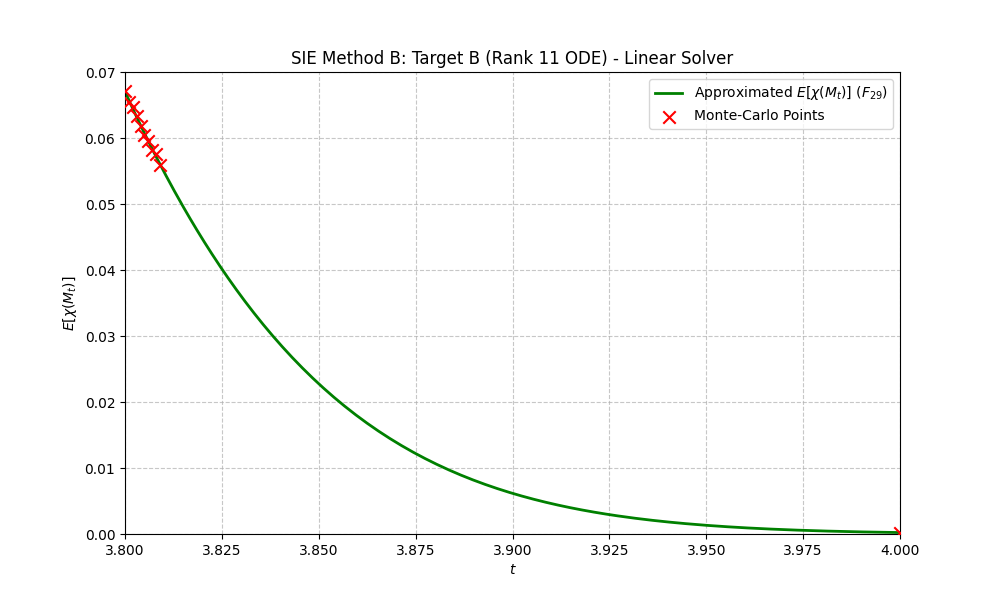
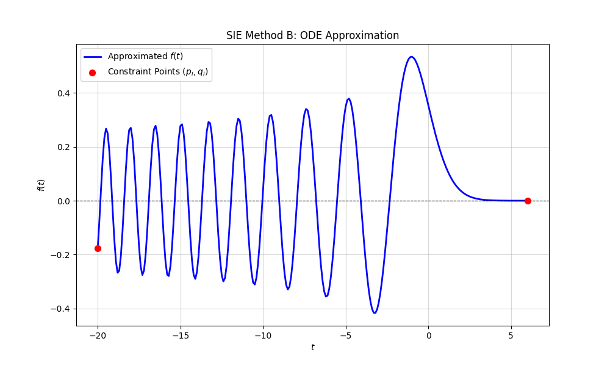

# sie-method-b
Implementation of the Holonomic Sparse Interpolation/Extrapolation (SIE) method B.

We implemented "SIE Method B" (Holonomic Sparse Interpolation/Extrapolation Method B, or it is abbreviated "HIE Method B")
[https://arxiv.org/abs/2111.10947]
on several computer algebra systems  with the assistance
of  Gemini 3.1 Pro ([Risa/Asir gem v7](https://gemini.google.com/gem/1-OoG766iQlM7YbW9hAS1aYMebKOpGEKc?usp=sharing)).
Gemini 3.1 Pro is a system strong in mathematics and coding.
We deployed this method across five mathematical software systems: 
starting with a hybrid Risa/Asir and Python (SciPy) approach, 
followed by SageMath, Mathematica, 
Julia/OSCAR, and Maple. 
The new programming paradigm, where humans strictly define the mathematical essence (What/Why) of an algorithm and rely on AI assistance, can significantly
reduce development time.

- Risa/Asir and python. 
  input-ode.rr is an ODE data. Start Risa/Asir and
 ```
  load("tk_sie_b.rr");  
  quit();  // quit Risa/Asir
  python ex_2026_04_01_E_solve_sie_gpu.py 
 ```
  <br>
  Simple ODE example (Airy equation)
 ```
 load("ex-2026-04-01-airy.rr");
 quit(); // quit Risa/Asir
 python ex_2026_04_01_airy_solve_sie_gpu.py
 ```
  <br>
- Maple. input-ode.txt is an ODE data. 
 ``` 
  read `maple_2024_04_02_sie_method_b.mpl`;
 ```
- Mathematica. input-ode.txt is an ODE data. 
 ```
 <<"math_2026_04_02_sie_method_b.m"
 ``` 
- OSCAR. input-ode.txt is an ODE data. Start julia and
 ```
 include("oscar_2026_04_02_sie_method_b.jl")
 ```
- SageMath. input-ode.txt is an ODE data.
 ```
 load('sage_2026_04_02_sie_method_b.sage')
 ```


## Summary in Japanese.
「SIE Method B」（ホロノミック スパース補間／外挿法B,
「HIE Method B」と略す時もある)
[https://arxiv.org/abs/2111.10947]
を、Gemini 3.1 Proの支援を受けて([Risa/Asir gem v7](https://gemini.google.com/gem/1-OoG766iQlM7YbW9hAS1aYMebKOpGEKc?usp=sharing))、複数の数式処理システムに実装しました。
Gemini 3.1 Proは、数学とプログラミングに優れたシステムです。

この手法を、5つの数式処理ソフトウェアシステムに展開しました。
まず、Risa/AsirとPython（SciPy）を組み合わせたハイブリッドアプローチから始め、
次にSageMath、Mathematica、
Julia/OSCAR、そしてMapleへと展開しました。

人間がアルゴリズムの数学的な本質（何をするのか／なぜするのか）を厳密に定義し、AIの支援に頼るという新しいプログラミングパラダイムは、
開発時間を大幅に短縮できます。
